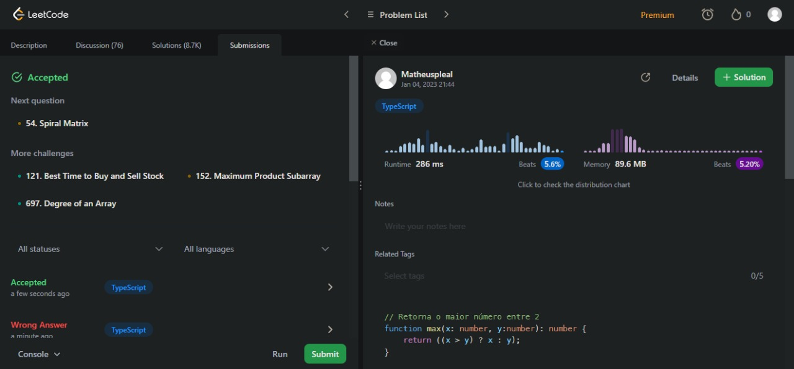
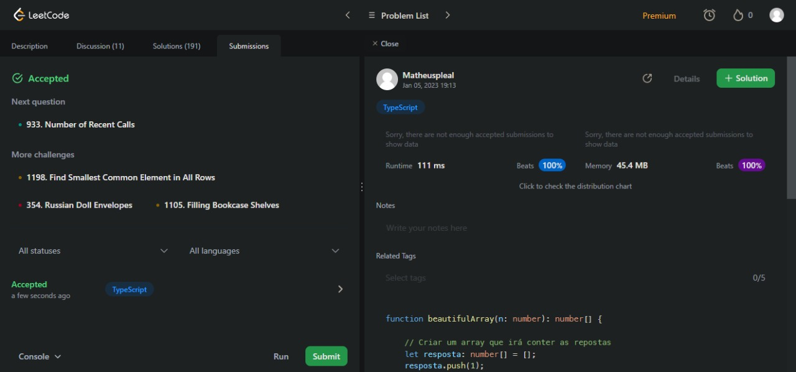
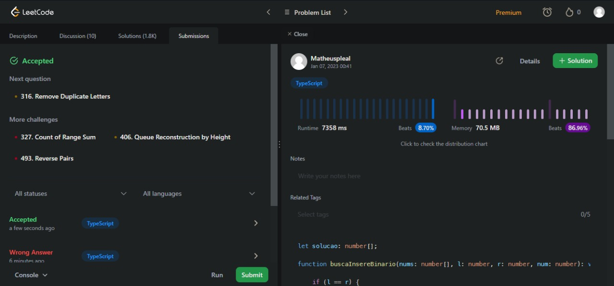

# DC_Dupla01-Questoes
## Questões escolhidas:
### Questão 1: 108.Convert Sorted Array to Binary Search Tree
#### Dificuldade
Easy
#### Link para a questão
https://leetcode.com/problems/convert-sorted-array-to-binary-search-tree/
#### Enunciado
Given an integer array *nums* where the elements are sorted in ascending order, convert it to a height-balanced binary search tree.
#### Print com a questão Aceita

### Questão 2: 53. Maximum Subarray
#### Dificuldade
Medium
#### Link para a questão
https://leetcode.com/problems/maximum-subarray/
#### Enunciado
Given an integer array *nums*, find the subarray which has the largest *sum* and return its *sum*.
#### Print com a questão Aceita

### Questão 3: 932. Beautiful Array
#### Dificuldade
Medium
#### Link para a questão
https://leetcode.com/problems/beautiful-array/
#### Enunciado
An array *nums* of length *n* is **beautiful** if:

*nums* is a permutation of the integers in the range *[1, n]*.
For every *0 <= i < j < n*, there is no index *k* with *i < k < j* where *2 * nums[k] == nums[i] + nums[j]*.
Given the integer *n*, return any **beautiful** *array* nums of length *n*. There will be at least one valid answer for the given *n*.
#### Print com a questão Aceita

### Questão 4: 315. Count of Smaller Numbers After Self
#### Dificuldade
Hard
#### Link para a questão
https://leetcode.com/problems/count-of-smaller-numbers-after-self/
#### Enunciado
Given an integer array nums, return an integer array counts where counts[i] is the number of smaller elements to the right of nums[i].
#### Print com a questão Aceita
